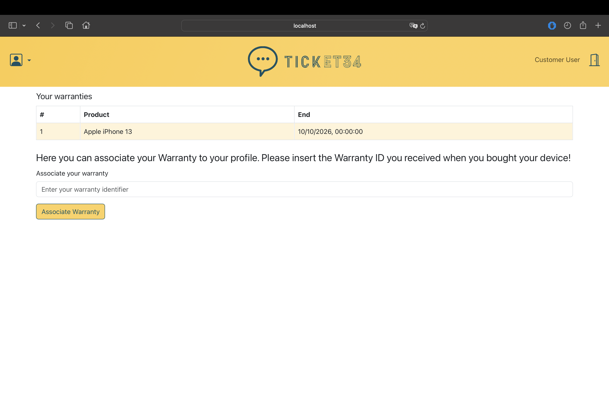

# Web-Application-II-Project

# Ticket34 Web Application Project

## Overview

Ticket34 is a web application project aimed at providing an efficient and user-friendly ticketing service. The platform is designed to streamline the process of handling and managing tickets for various events, support requests, or any other instances requiring ticketing services.

## Features

### 1. User Authentication
   - Secure user registration and login functionalities.
   - Role-based access control for administrators and regular users.

### 2. Ticket Creation and Management
   - Intuitive ticket creation forms with relevant fields.
   - Real-time ticket tracking and status updates.
   - Attachment support for additional documentation.

### 3. Event Ticketing
   - Capability to create and manage tickets specifically for products.

### 4. Notifications
   - Notifications for ticket updates and important announcements.

### 5. Reporting and Analytics
   - Comprehensive reporting tools for administrators.
   - Analytics to track interactions.

## Technology Stack

### Frontend
   - React.js for responsive and dynamic user interfaces.
   - Redux for state management.

### Backend Authentication and Security
   - JSON Web Tokens (JWT) for secure user authentication.
   - HTTPS to ensure data encryption during transmission.
   - Cross-Origin Resource Sharing (CORS) implementation.

## Screenshots

### User Hompage

*Description: Overview of the user's homepage.*

### Manager Hompage

*Description: Overview of the manager's homepage.*

### Manager WorkersList

*Description: Overview of the manager's list of workers.*

### Create Ticket

*Description: Intuitive ticket creation form with relevant fields.*

### Details Ticket

*Description: Page for view tickets details.*

### Warranties

*Description: Page for add warranties and view details of them.*

### Chat

*Description: Customizable notification preferences for users.*
